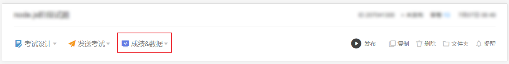

# wjx-score-downloader

问卷星成绩批量下载插件

## 安装

### 安装插件

将 `extension` 目录作为未打包插件在浏览器上进行安装

### 安装服务器

先安装 `node.js v18`

然后运行后续命令

```shell
cd server
npm install
```

## 使用

先启动服务器

```shell
node server/app.js
```

再打开问卷星，选择下载成绩，如图:



然后输入保存文件的目录路径，点击 `批量下载`


